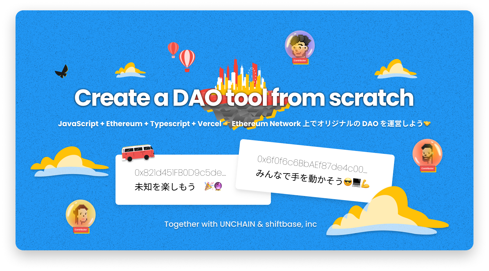

# Create your DAO.

このコースを始めるには、下記のステップを実行してください。

1. あなたの Github アカウントにこのレポジトリをフォークしましょう。

2. クローンしたレポジトリをあなたのローカル環境にダウンロードしましょう。

3. ターミナルを開き、ディレクトリのルートで `yarn install` を実行します。

4. `yarn dev` を実行してプロジェクトを開始します。

5. コーディングを始めましょう。
